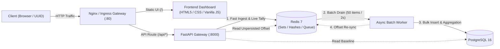

# Quorum: Multi-Tier Containerized Application Deployment in Kubernetes with Kustomize Overlays

[](https://fastapi.tiangolo.com)
[](https://www.python.org)
[](https://www.postgresql.org)
[](https://redis.io)
[](https://nginx.org)
[](https://www.docker.com)
[](https://kubernetes.io)
[](https://kustomize.io)
[](https://github.com/GoogleContainerTools/distroless)
[](https://www.linkedin.com/in/narenpradhan)

A distributed, event-driven voting and polling application designed for hands-on **Docker**, **Kubernetes**, **Kustomize**. The project features an asynchronous **FastAPI** gateway, an in-memory **Redis** queue and cache layer, an asynchronous background **Python Worker**, a persistent **PostgreSQL** database, and an **Nginx** reverse-proxy frontend.

---

## Table of Contents

- [Project Overview](#project-overview)
- [Application Architecture](#application-architecture)
- [Project Structure](#project-structure)
- [API Endpoints & Contract](#api-endpoints--contract)
- [Running with Docker Compose](#running-with-docker-compose)
- [Kubernetes Deployment & Kustomize Overlays](#kubernetes-deployment--kustomize-overlays)
- [Load Testing & Benchmarking](#load-testing--benchmarking)
- [Hands-on DevOps Tasks Roadmap](#hands-on-devops-tasks-roadmap)
- [Connect with Me](#connect-with-me)
- [Copyright & Usage Notice](#copyright--usage-notice)

---

## Project Overview

### Introduction
**Quorum** is a real-time polling application built to handle heavy voting traffic without slowing down or locking the database. Instead of writing every vote straight to disk, Quorum decouples vote collection from storage:

- **Instant Ingestion**: FastAPI receives votes and immediately stores them in Redis in memory, sending a quick success response back to the user.
- **Anti-Bias Privacy**: Poll percentages and vote counts stay hidden until a user casts their vote, keeping results unbiased.
- **Background Batch Saving**: An asynchronous worker pulls votes from Redis in batches and saves them into PostgreSQL, reducing database load.
- **Live Frontend**: An Nginx-powered web interface lets users browse polls, vote, and instantly view updated results.

### Key Features
- **Asynchronous Voting Pipeline**: Fast response times with no direct database locks on user voting requests.
- **One Vote Per User**: Redis and PostgreSQL enforce unique voter identities to prevent duplicate votes.
- **Distroless Containers**: Lightweight and secure container images built without unnecessary packages or shells.
- **Kustomize Overlays**: Clean separation between `dev` (single replica, light resources) and `prod` (multi-replica, high resources).
- **Graceful Shutdown**: Worker flushes pending in-memory votes before stopping to ensure zero data loss.
- **Load Testing Suite**: Built-in scripts to simulate hundreds of concurrent voters and measure performance.

---

## Application Architecture

The following diagram shows how traffic flows through the system in Kubernetes:


```mermaid
graph LR
    Client["Client (Browser / UUID)"] -->|"HTTP Traffic"| Gateway["Nginx / Ingress Gateway (:80)"]
    
    Gateway -->|"Static UI (/)"| Frontend["Frontend Dashboard\n(HTML5 / CSS / Vanilla JS)"]
    Gateway -->|"API Route (/api/*)"| API["FastAPI Gateway (:8000)"]
    
    API -->|"1. Fast Ingest & Live Tally"| Redis[("Redis 7\n(Sets / Hashes / Queue)")]
    Redis -->|"2. Batch Drain (50 items / 2s)"| Worker["Async Batch Worker"]
    Worker -->|"3. Bulk Insert & Aggregation"| Postgres[("PostgreSQL 16")]
    
    Worker -.->|"4. Offset Re-sync"| Redis
    API -.->|"Read Baseline"| Postgres
    API -.->|"Read Unpersisted Offset"| Redis
```

### Architecture Highlights:
1. **No Direct Disk Writes During Voting**: FastAPI puts votes into a Redis queue in memory and acknowledges them with `202 Accepted` in milliseconds.
2. **Batch Persistence**: The worker reads votes in batches and writes them to PostgreSQL in single queries, avoiding database locking.
3. **Instant Live Results**: Real-time poll counts combine PostgreSQL base data with live Redis tally offsets.
4. **Stateful Storage**: PostgreSQL and Redis run as Kubernetes `StatefulSets` with persistent volume claims to preserve data across pod restarts.

---

## Project Structure

```text
Quorum/
├── application/
│   ├── backend/
│   │   └── app/
│   ├── frontend/
│   │   └── src/
│   ├── worker/
│   │   └── app/
│   └── db/
├── docker_files/
├── k8s_kustomize/
│   ├── base/
│   │   ├── backend/
│   │   ├── configs/
│   │   ├── frontend/
│   │   ├── ingress/
│   │   ├── postgres/
│   │   ├── redis/
│   │   └── worker/
│   └── overlays/
│       ├── dev/
│       │   └── patches/
│       └── prod/
│           └── patches/
├── k8s_manifests/
│   ├── backend/
│   ├── configmaps/
│   ├── frontend/
│   ├── ingress/
│   ├── postgres/
│   ├── redis/
│   ├── secrets/
│   └── worker/
└── scripts/
```

---

## API Endpoints & Contract

### Endpoints Summary

| Method | Endpoint | Description | Response Status |
| :--- | :--- | :--- | :--- |
| `GET` | `/healthz` | **Liveness Probe**: Confirms process is running | `200 OK` |
| `GET` | `/readyz` | **Readiness Probe**: Verifies PostgreSQL & Redis connectivity | `200 OK` / `503 Unavailable` |
| `GET` | `/api/polls` | List all polls (statistics hidden until user votes) | `200 OK` |
| `GET` | `/api/polls/{id}` | Retrieve individual poll details and vote state | `200 OK` / `404 Not Found` |
| `POST` | `/api/polls/{id}/vote` | Cast an asynchronous vote ballot | `202 Accepted` / `409 Conflict` |

---

### Sample `curl` Requests & Responses

#### 1. Liveness & Readiness Checks
```bash
curl -i http://localhost:8000/healthz
curl -i http://localhost:8000/readyz
```
**Response (`200 OK`):**
```json
{
  "status": "ready",
  "database": "connected",
  "redis": "connected"
}
```

#### 2. Querying Polls Before Voting (Concealed State)
When a user has not voted yet, counts and percentages are hidden:
```bash
curl -s "http://localhost:8000/api/polls?voter_fingerprint=user_101"
```
**Response (`200 OK`):**
```json
[
  {
    "id": 1,
    "title": "What is your preferred container orchestration tool?",
    "description": "Cast your vote for the primary orchestration framework driving your modern infrastructure stack.",
    "created_at": "2026-10-01T10:00:00Z",
    "options": [
      { "id": 1, "poll_id": 1, "label": "Kubernetes", "vote_count": null, "percentage": null },
      { "id": 2, "poll_id": 1, "label": "Docker Swarm", "vote_count": null, "percentage": null },
      { "id": 3, "poll_id": 1, "label": "Nomad", "vote_count": null, "percentage": null },
      { "id": 4, "poll_id": 1, "label": "Bare Metal", "vote_count": null, "percentage": null }
    ],
    "has_voted": false,
    "user_voted_option_id": null,
    "total_votes": null
  }
]
```

#### 3. Submitting a Vote
```bash
curl -i -X POST http://localhost:8000/api/polls/1/vote \
     -H "Content-Type: application/json" \
     -d '{"option_id": 1, "voter_fingerprint": "user_101"}'
```
**Response (`202 Accepted`):**
```json
{
  "status": "queued",
  "poll_id": 1,
  "option_id": 1
}
```

#### 4. Querying Polls After Voting (Revealed State)
Once voted, live counts and percentages are displayed:
```bash
curl -s "http://localhost:8000/api/polls?voter_fingerprint=user_101"
```
**Response (`200 OK`):**
```json
[
  {
    "id": 1,
    "title": "What is your preferred container orchestration tool?",
    "description": "Cast your vote for the primary orchestration framework driving your modern infrastructure stack.",
    "created_at": "2026-10-01T10:00:00Z",
    "options": [
      { "id": 1, "poll_id": 1, "label": "Kubernetes", "vote_count": 1, "percentage": 100.0 },
      { "id": 2, "poll_id": 1, "label": "Docker Swarm", "vote_count": 0, "percentage": 0.0 },
      { "id": 3, "poll_id": 1, "label": "Nomad", "vote_count": 0, "percentage": 0.0 },
      { "id": 4, "poll_id": 1, "label": "Bare Metal", "vote_count": 0, "percentage": 0.0 }
    ],
    "has_voted": true,
    "user_voted_option_id": 1,
    "total_votes": 1
  }
]
```

#### 5. Duplicate Vote Rejection
Attempting to vote again returns `409 Conflict`:
```bash
curl -i -X POST http://localhost:8000/api/polls/1/vote \
     -H "Content-Type: application/json" \
     -d '{"option_id": 2, "voter_fingerprint": "user_101"}'
```
**Response (`409 Conflict`):**
```json
{
  "detail": "You have already cast a vote on this poll. Changing votes is not permitted."
}
```

---

## Running with Docker Compose

You can launch the complete application stack locally using `docker-compose-v2.yml`:

### 1. Start the Stack
```bash
docker compose -f docker_files/docker-compose-v2.yml up -d
```

### 2. Verify Status & Logs
```bash
# Check container status
docker compose -f docker_files/docker-compose-v2.yml ps

# View live logs
docker compose -f docker_files/docker-compose-v2.yml logs -f backend worker
```

### 3. Access Services
- **Web Dashboard**: [http://localhost:8080](http://localhost:8080)
- **API Swagger Documentation**: [http://localhost:8000/docs](http://localhost:8000/docs)

### 4. Teardown
```bash
docker compose -f docker_files/docker-compose-v2.yml down -v
```

---

## Kubernetes Deployment & Kustomize Overlays

Quorum provides a declarative Kustomize layout for managing development and production environments:

- **`k8s_kustomize/base/`**: Base manifests and configuration files (`01-init.sql`, `default.conf`, `backend.env`, `db.env`).
- **`k8s_kustomize/overlays/dev/`**: Namespace `dev`, single replica per service, lightweight resource limits, and `dev.quorum.local.com` host.
- **`k8s_kustomize/overlays/prod/`**: Namespace `prod`, multi-replica scaling (3x API, 2x Frontend, 2x Worker), production resource limits, and `quorum.local.com` host.

---

### Minikube Deployment Steps

#### 1. Start Minikube & Enable Ingress
```bash
minikube start
minikube addons enable ingress
```

#### 2. Configure Local Hostnames
Map your Minikube IP address to the ingress domains in `/etc/hosts`:
```bash
MINIKUBE_IP=$(minikube ip)
echo "$MINIKUBE_IP quorum.local.com dev.quorum.local.com" | sudo tee -a /etc/hosts
```

#### 3. Deploy Production Overlay
```bash
kubectl apply -k k8s_kustomize/overlays/prod
```

*(Or deploy the development overlay instead)*:
```bash
kubectl apply -k k8s_kustomize/overlays/dev
```

#### 4. Verify Resources
```bash
kubectl get pods -n prod
kubectl get ingress -n prod
```

#### 5. Open in Browser
Visit [http://quorum.local.com](http://quorum.local.com) (or [http://dev.quorum.local.com](http://dev.quorum.local.com) for Dev).

---

## Load Testing & Benchmarking

Quorum includes automated benchmark tools in the `scripts/` directory to simulate concurrent voters and measure system throughput and latency:

- `load_test.py`: Runs a concurrent load test using `httpx` or Python's built-in `ThreadPoolExecutor`.
- `progressive_load_test.py`: Runs an escalating multi-stage ramp-up stress test from 2,000 up to 50,000 requests.

### CLI Arguments Reference (`load_test.py`)

| Argument | Flag | Type | Default | Description |
| :--- | :--- | :--- | :--- | :--- |
| `--requests` | `-n` | `int` | `500` | Total number of vote requests to execute |
| `--concurrency` | `-c` | `int` | `25` | Number of simultaneous concurrent connections |
| `--users` | `-u` | `int` | `100` | Number of simulated virtual users with unique identities |
| `--base-url` | | `str` | `http://localhost:8080` | Target URL (Nginx ingress or direct backend API) |
| `--verbose` | `-v` | `flag` | `False` | Print live latency and status for each request |
| `--help` | `-h` | `flag` | | Show help message and exit |

### Running Benchmarks

```bash
# Standard benchmark against Ingress (500 requests, 25 concurrency)
python3 scripts/load_test.py --base-url http://quorum.local.com -n 500 -c 25

# High-throughput test (2,000 requests, 100 concurrency)
python3 scripts/load_test.py --base-url http://quorum.local.com -n 2000 -c 100 -u 300

# Progressive multi-stage ramp-up test
python3 scripts/progressive_load_test.py
```

### Sample Benchmark Output
```text
============================================================
                 STARTING LOAD TEST
============================================================
Target URL            : http://quorum.local.com
Total Requests        : 3000
Concurrency Level     : 200
Simulated Users       : 400
Engine                : standard library (ThreadPoolExecutor)
------------------------------------------------------------

============================================================
               QUORUM LOAD TEST SUMMARY
============================================================
Total Requests Processed : 3000
Total Time Taken         : 54.56 seconds
Throughput Rate          : 54.99 requests/sec
Status Code Breakdown    : {0: 568, 202: 2432}
Successful Requests      : 2432 (81.1%)
Failed Requests          : 568 (18.9%)
------------------------------------------------------------
Latency Breakdown:
  Min Latency            : 2.56 ms
  Average Latency        : 3407.04 ms
  Median (P50)           : 791.83 ms
  95th Percentile (P95)  : 15016.42 ms
  99th Percentile (P99)  : 15019.37 ms
  Max Latency            : 15026.75 ms
============================================================
```

---

## Hands-on DevOps Tasks Roadmap

If you want to practice building, containerizing, deploying, and scaling this distributed architecture step-by-step from scratch, follow the structured practice roadmap in [TASKS.md](TASKS.md).

Use [TASKS.md](TASKS.md) as a hands-on checklist: research and solve each challenge independently, and use the manifests, Dockerfiles, and Kustomize overlays in this repository as your reference solutions.

---

## Connect with Me

[](https://www.linkedin.com/in/narenpradhan)

---

## Copyright & Usage Notice

> [!IMPORTANT]
> **Copyright & Usage Notice**
> This repository, its architecture diagrams, code watermarks, and documentation are authored and maintained by **Naren Pradhan** ([@Narenpradhan](https://github.com/Narenpradhan)).
> 
> - You are encouraged to clone, review, and use this repository as a guide for hands-on personal learning and DevOps skill-building.
> - **Plagiarism, direct duplication, re-hosting without attribution, or claiming this work as your own in technical interviews, portfolio submissions, or commercial projects is strictly prohibited.**
